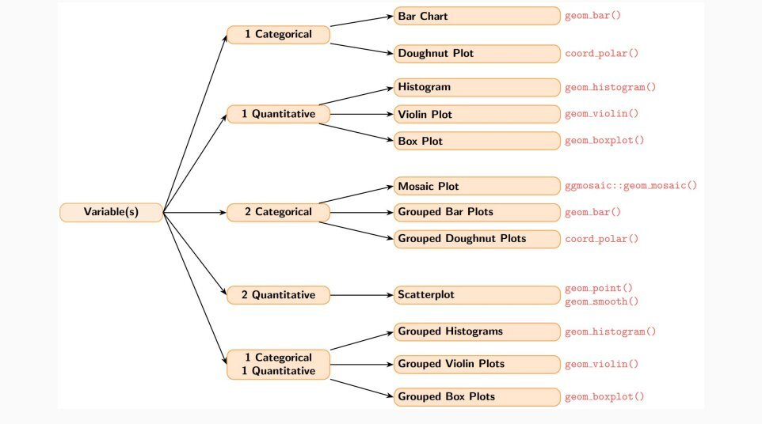

## What is Tidyverse?  
The tidyverse package is a collection of libraries in R that streamline data manipulation. Some of the most common functions we used during labs include:

* **tibble()**
    * Constructs an enhanced data frame called a tibble
* **read_csv()**
    * Like read.csv() but returns a tibble and functions faster
* **mutate()**
    * Used to create new or edit previous variables/columns
* **filter()**
    * Can select rows that specify certain conditions
* **group_by()**
    * For specifying grouped variables for data operations
* **|>**
    * A "pipe" which is used to make code easier to read by feeding previous operations to the next line
* **case_when()**
    * When multiple if_else() conditions need to be checked
* **summarize()**
    * Allows to ask for statistics calculated on selected columns of a data frame
* **separate()**
    * Used to separate a column into multiple columns using a delimiter

**Why use Tidyverse over Base R?**  
Tidyverse notation is easier to read and write compared to base R. Using pipes, |>, steps flow from line to line, making the code easier to follow and understand, which also makes comments more comprehensible because you can add descriptions to each step as you go.


## What is Ggplot?  
Ggplot2 is a data visualization package in tidyverse used to create clear, customizable graphs. It is based on layers, where you build plots step by step by adding components like data, axes, and visual elements.  
**Things to keep in mind:**  

* What shape will the data follow, if any
* Put the plot in a figure environment so it is nicely formatted. We will use a couple of parameters for the environment:
    * label: How we can refer to the figure later in the file
    * fig-cap: What the title will show up as
    * fig-width: how many inches wide the plot will be
    * fig-height: how many inches high the plot will be
    * fig-align: where relative to the page the figure will appear

Let's simulate random data following the normal distribution to work with. The seed will ensure it does not change.
```{r}
set.seed(61)
data = data.frame(
  var1 = rnorm(100),
  var2 = rnorm(100)
)
``` 
First you tell your plot what data to use. I added theme_bw() and labs() to clean up the graph by making it black and white with custom axis labels:
```{r}
#| label: emptyPlot
#| fig-cap: "Empty Plot"
#| fig-width: 5
#| fig-height: 3
#| fig-align: "center"


library(ggplot2)
ggplot(data, aes(x = var1, y = var2)) +
    labs(x = "variable1 data",
       y = "variable2 data") +
    theme_bw()
```  
Then use geom to actually add a shape to the plot:
```{r}
#| label: withGeom
#| fig-cap: "Scatter Plot of Data"
#| fig-width: 5
#| fig-height: 3
#| fig-align: "center"


ggplot(data, aes(x = var1, y = var2)) +
  geom_point() +
  labs(x = "variable1 data",
       y = "variable2 data") +
  theme_bw()
```

One of the best uses for ggplot is data summarization, a key step in data analysis once you have cleaned the data set using tidyverse. One of the most important decisions is choosing which geom is right for your data. One way is to check what variables your data consists of.



**1 Categorical Variable**  
Go to plots would be either a bar plot or a doughnut plot.

* geom_bar()
* coord_polar()

**1 Quantitative Variable**  
Go to plots are a histogram, violin plot, and box plot. Helpful to overlay the violin plot on a box plot.

* geom_histogram()
* geom_violin()
* geom_boxplot()

**2 Categorical Variables**  
Go to plots are the mosaic, grouped bar, and grouped doughnut plots.

* ggmosaic::geom_mosaic()
* geom_bar()
* coord_polar()

**2 Quantitative Variables**
Go to plot is the scatterplot.

* geom_point()
* geom_smooth()

**1 Categorical and 1 Quantitative Variable**
Go to plots are grouped histogram, grouped violin, and grouped box plots. Helpful to overlay a box plot on a violin plot.

* geom_historgram()
* geom_violin()
* geom_boxplot()

## Plotting Data
Let's see these plots in action. But first, we will need some data.
```{r}
set.seed(61)
n = 200

data = data.frame(
    # One quantitative variable
    score = rnorm(n, mean = 75, sd = 10),
  
    # Two quantitative variables
    study_hours = runif(n, 0, 10),
    exam_grade  = 50 + 4 * runif(n, 0, 10) + rnorm(n, sd = 5),
  
    # One categorical variable
    genre = sample(c("Rock", "Pop", "Jazz", "Classical"), n, replace = TRUE),
  
    # Two categorical variables
    grade_level = sample(c("Freshman", "Sophomore", "Junior", "Senior"), n,
                           replace = TRUE), pass_fail   = sample(c("Pass", "Fail"),
                           n, replace = TRUE, prob = c(0.75, 0.25)),

    # One categorical variable and one quantitative variable
    subject = sample(c("Math", "English", "Science", "History"), n, replace = TRUE)
)
```

Now let's make the graphs in order.

**This is a Bar plot for data with one categorical variable!**
```{r}
#| label: SingleBar
#| fig-cap: "Bar Plot"
#| fig-width: 5
#| fig-height: 3
#| fig-align: "center"


# Bar Plot
ggplot(data, aes(x = genre)) +
geom_bar(fill = "lightblue") +
labs(x = "Genre", y = "Count") +
theme_bw()
```

A bar plot is used to visualize the frequency of a single categorical variable. Each bar represents a category and the height tells you how many observations fall into that group. Here the four genres: Rock, Pop, Jazz, and Classical are roughly equally represented since we sampled them randomly.

**These are the histogram, violin, and box plots for data with one quantitative variable!**
```{r}
#| label: Histogram
#| fig-cap: "Histogram Plot"
#| fig-width: 5
#| fig-height: 3
#| fig-align: "center"


# Histogram
ggplot(data, aes(x = score)) +
  geom_histogram(fill = "pink", color = "black") +
  labs(x = "Score", y = "Count") +
  theme_bw()
```

A histogram shows the distribution of a single quantitative variable by grouping values into bins. Here the scores follow a bell curve centered around 75, which makes sense since we simulated them from a normal distribution with mean 75.

```{r}
#| label: ViolinAndBox
#| fig-cap: "Violin Plot and Box Plot Overlay"
#| fig-width: 5
#| fig-height: 3
#| fig-align: "center"


# Violin Plot and box plot overlay
ggplot(data, aes(x = "", y = score)) +
  geom_violin(fill = "darkorchid") +
  geom_boxplot(width = .3) + 
  labs(x = "", y = "Score") +
  theme_bw()
```

A violin plot shows the full distribution of the data through its width, while the overlaid box plot highlights the median and interquartile range. Together they give a more complete picture than either alone. The violin confirms the scores are roughly symmetric around 75, and the box plot shows the middle 50% of scores fall within a fairly tight range.

**Here is the grouped bar plot for data with 2 categorical variables!**
```{r}
#| label: GroupBar
#| fig-cap: "Grouped Bar Plot"
#| fig-width: 5
#| fig-height: 3
#| fig-align: "center"


# Grouped Bar Plot
ggplot(data, aes(x = grade_level, fill = pass_fail)) +
  geom_bar() +
  labs(x = "Grade Level", y = "Count", fill = "Result") +
  theme_bw()
```

A grouped bar plot extends the standard bar plot to two categorical variables by using color to distinguish between groups. Here we can compare pass/fail counts across each grade level. Again since we simulated around 75%, about 3 quarters passed.

**Here is a scatterplot for data with two quantitative variables!**
```{r}
#| label: scatter
#| fig-cap: "Scatter Plot of Data"
#| fig-width: 5
#| fig-height: 3
#| fig-align: "center"

ggplot(data, aes(x = study_hours, y = exam_grade)) +
    geom_point() +
    geom_smooth() +
    labs(x = "Study Hours", y = "Exam Grade") +
    theme_bw()
```

A scatterplot is used when you have two quantitative variables and want to see if a relationship exists between them. Each point represents one student. Geom_smooth() helps add a trendline, and although there is a slight upward movement, study hours and exam grade don't seem to be very correlated in our randomly sampled data.

**Here are grouped histogram, violin, and box plots for data with one quantitative variable and one categorical variable!**
```{r}
#| label: GroupedHistogram
#| fig-cap: "Grouped Histogram"
#| fig-width: 5
#| fig-height: 3
#| fig-align: "center"


# Grouped Histogram
ggplot(data, aes(x = score, fill = subject)) +
  geom_histogram(binwidth = 5, alpha = 0.6) +
  labs(x = "Score", y = "Count") +
  theme_bw()
```

A grouped histogram overlays multiple histograms on the same plot using color to separate categories. This lets you compare the distribution of a quantitative variable across different groups at once. Since scores were simulated independently of subject, the distributions overlap heavily. All four subjects are centered around 75 with similar spread.

```{r}
#| label: GroupedViolinWithBox
#| fig-cap: "Grouped Violin Plot with Grouped Box Plot"
#| fig-width: 5
#| fig-height: 3
#| fig-align: "center"


# Grouped Violin Plot
ggplot(data, aes(x = subject, y = score, fill = subject)) +
  geom_violin(alpha = 0.7) +
  geom_boxplot(width = .3) +
  labs(x = "Subject", y = "Score") +
  theme_bw()
```

By grouping violin and box plots by a categorical variable, we can compare distributions across groups side by side. The box plot allows us to easily tell which subject has a higher median, here it is math. We can also see where subjects tend to cluster, with English seeming to have more extremes in the higher scores. This is a good plot for grouped comparisons.
